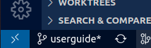
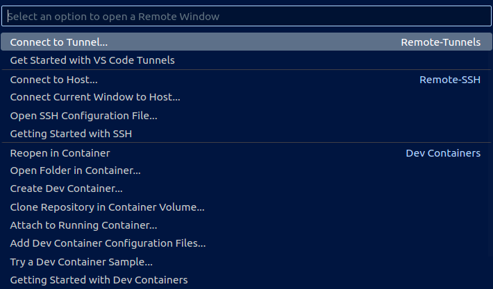
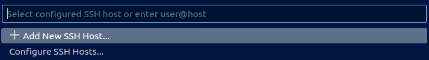
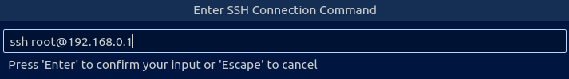
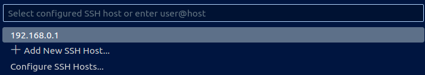
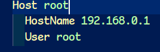
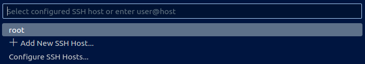

# **AIVC-Server-Booking User Manual**

## **1. Introduction**  

AIVC-Server-Booking aims to let users easily get required computing resources such as :  

* **RAM**  
* **GPU**  
* **CPU**.  

Simultaneously, this system will efficiently manage the server's resources between different users without conflicts.  

Our team uses the package, **Docker**, as an important tool to help us distribute resources. Why we use Docker  because it has some characteristics that will be briefly introduced in the following article :  

>With Docker, you can easily package and  deploy your applications. It will collect the infrastructure resources and applications, which the project requires.
>
>Those environmental settings are dictated by Docker file which has instructions on how to build the environment (container). You can customize it on your will.
>
>After running the docker file, you can get the container you want. The last and important property is that Docker allows different containers to operate simultaneously without affecting  other containers.

Because of those properties, when a user wants to take advantage of the server's computing capability, he no more worries about problems caused by different environments and he can focus on his project.  

Besides integrating Docker, our team try to make this system more usable so we add additional functions to it as follows :

1. User can customize their required resources with CLI.
2. The host maintainer can supervise the state of the server easily.  

Now, let's start with the instructions of AIVC-Server-Booking system.

---

## **2. Before Booking......**

Before booking AIVC's server, there is something you should know ......

1. Ask the host maintainer for a new account first. Every account has default limitations of resources. If you want more, you can go to discuss with the host maintainer.

2. You will be forbidden to access the server if your used space is out of range. You must sort out your memory space before using the server.

3. Every container is removed after it runs out of time to release the computing resources being utilized.

4. There are three main directories in each container,  and those directories will be volumed to corresponding ones in the host. Let's take a look at their purposes :  

    `backup_dir`  
    Aims to store the configs customized by the user. Because a container will be removed when it runs out of time, all environmental configures such as *zshrc*, *pyenv*, also will be deleted. This system helps you back up your environmental setting so you don't need to reset all environment configs in next time.

    When you want to backup files or directories, you should write down your needs in `backup.yaml` and follow the form shown below :  

    ```yaml  
    # Under the Backup
    Dir: 
      - - < Backup's dir_path>    # Backup is a folder in the host
        - < container's dir_path> # must be absolute path  
    
    File: 
      - - < Backup's file_path>    # Backup is a folder in the host
        - < container's file_path> # must be absolute path
    ```  

    For example :

    ```yaml  
    Dir: 
    - - .default/.pyenv 
      - /root/.pyenv 
    File: 
    - - .zshrc 
      - /root/.zshrc 
    ```

    `work_dir`  
    Store user's projects and personal datasets. Because the booking system will automatically remove containers with an empty `work_dir`, you should ensure the `work_dir` has projects in it to avoid your container from being removed.

    `dataset_dir`  
    It is a read-only folder and supports some common public datasets to every user such as COCO datasets. If you have demands about public datasets, you can ask the host maintainer for them. The host maintainer will add them to the directory. With the management, all users can access the public datasets, and no need to download them again.

---

## **3. Booking Usage**

In this topic, I will instruct the operations of booking step by step including the booking method, and describe extra options.  

### **CLI Commands**

`-h` or `--help`: Get the manpage about this system.

  ```zsh
  python3 booking.py -h
  ```

`-ls` or `--list-schedule`:   List the all booked schedules.

  ```zsh
  python3 booking.py -ls
  ```

`id` or `--user-id`: Log in the system to book the server.

```zsh
python3 booking.py -id <user_id>
```

`-use-opt` or `--use-options`: Update user's config.

```zsh
python3 booking.py -use-opt <user_id>
```

Notice that you should ask the host maintainer for an account first before accessing this system.

#### **I. Log in steps**

This system will ask you to input the password. You have two chances to input :

```bash
Password:
```

After that, describe how many resources the container requires :

```bash
Your Maximum Capability Information: 
{ cpus:xx, memory:xx, gpus:xx }
Please enter the capability information 'cpus(float) memory(int) gpus(int)': 
```

As shown above, the first line shows the maximum limitations of **CPUs**, **Memories**, and **GPUs**.
All inputs **cannot be lower than 1**. Lower ones are forbidden.

The final step is to select when you want to run the container and its end time. There are some limits you should know :

* The input value should follow the `datetime format` or use `Time_Flags`.  
* `mm` format must be `"00"` or `"30"`.
* `Time_Flags` only can be used for `end time`.

```bash
Please enter the start time 'YYYY MM DD hh mm': XXXX XX XX XX
Please enter the end time 'YYYY MM DD hh mm': XXXX XX XX XX
```

Usable `Time_Flags` are shown in the below form :
  | Flag | Description |
  |--|--|
  | <font color=#CE9178>now</font> | Run the container immediately if the usage is available. |
  | <font color=#CE9178>{num}-day</font>  | The range of the <font color=#CE9178>num</font> is `1~14`, 24 hrs for a unit. |
  | <font color=#CE9178>{num}-week</font> | The range of the <font color=#CE9178>num</font> is `1~2`, 7 days for a unit. |

After the system has already checked that the computing resources are affordable and that no problems have occurred, your booking is successful.

#### **II. Update Account Setting**

The system will prompt you to confirm  whether you want to modify the `forward_port`. The `forward_port` must be assigned a value between **10000** and **11000**. Why we choose this range because the `forward_port` in this range isn't related to critical features.  Additionally, the system will automatically check whether the `forward_port` you want is duplicated. For more details, go to check [List of TCP and UDP port numbers](https://en.wikipedia.org/wiki/List_of_TCP_and_UDP_port_numbers).

```zsh
Please enter the forward port(default: xxxxx, none by default):
```

You can specify your docker image, and the system will build the container based on your image.

```zsh
Please enter the image 'repository/tag'(default: xxx, none by default): 
```

You can customize your extra commands which will be executed when the system is building a container.

```zsh
Please enter the extra command when running the image. (default: None, none by default):
```

In this part, the system will ask you whether you want to update your password.  

```zsh
Do you want to update the password?
```

Double-check your changes. Make sure you want to update the config.

```zsh
The previous setting is for the once, do you want to update the default config?
```

---

## **4. Extra Useful Packages Introduction**  

After instructions, I recommend some packages and commands to you, which are useful for development.  
*( Here's a brief introduction. If you want to realize more, you can click the package name to view the detail.)*

### Environment Setting

Every project has its own required packages. The better way to develop is to build an independent environment for each project and let them can specify their own *Spec.*  
Here are some packages which can help you manage the environment :

#### [*pipenv & pyenv*](https://medium.com/ntust-aivc/how-to-install-pyenv-pipenv-in-ubuntu-and-use-multiple-versions-of-python-and-its-suites-3514099a6e05)

With *pyenv*, you can install different versions of python in the host and select the certain version which meets the project's needs. After that, use *pipenv* to create a clean virtual environment which is the developed environment. You can download the needed packages in a virtual environment without messing up the host.  

#### [*docker*](https://tw-yshuang.notion.site/Docker-Basic-Introduction-657f817e15a3490d83b84c8a143d6207)

*docker* can help package up codes and all their dependencies so the application runs quickly and reliably from one computing environment to another.
  
### CLI Tools

#### [*git*](https://medium.com/ntust-aivc/introduction-to-git-66473777b9b3)  

*git* is a **distributed version control system**. In this system, Every coworker has a full copy of the project and project history. According to the project history, you can check who contribute to the project and what kind of contribution he added so every coworker can have effective communication without barriers. No matter how many people you work with, *git* is an excellent tool to help you realize the whole process of the project. It's worth familiarizing.

#### [*htop*](https://www.ionos.com/digitalguide/server/tools/htop-the-task-manager-for-linux-mac-os-x-and-bsd/)

*htop* is a tool that can check the consumptions of computing resources such as **CPU & Memory occupancy**, **Load average**, **the total number of tasks and working thread**, and **information of every process**. By means of viewing the state of the computer, you can realize which process cost a large number of resources and kill the one which has bad effects on a computer. Checking computing resources help you analyze the efficacy of programs. It's worthwhile to use.

#### [*tmux*](https://www.hamvocke.com/blog/a-quick-and-easy-guide-to-tmux/)

**`tmux` is a terminal multiplexer.**  
It lets you switch easily between several programs in one terminal. When you detach a session, the programs are still running in the background. You can re-access the old programs after retaching. Because of this property, you can run programs in the background of the remote service even though you have detached from it. If you want to access old programs, you can connect to the service with `ssh` and retach the programs by means of `tmux`. That is one of `tmux`'s benefits.

`tmux` assists to open multiple **windows** and **panes** in one terminal. Each **pane** contains its own, independently running shell instance (`bash`, `zsh`, ...). You can operate multiple terminal commands and run applications side by side without creating multiple terminals.  

Conclude that `tmux` basically offers two major features:

1. **Window** management in your terminal  
2. **Session** management

In this system, we have customized two critical `tmux`'s features you should know :

* **Allow using mouse** to change the working place between different panes and windows.
* **Prefix hotkey has been turned into Ctrl+a ( C-a )**.

Some of hotkeys have been changed by [tmux_config](../imgae_setup/config/.tmux.conf) as follow :  

|Key|Description|
|:--:|:--|
|<font color=#CE9178>C-a</font> |prefix|
|<font color=#CE9178>prefix + \| </font>| split-window horizontally ()|
|<font color=#CE9178>prefix +  -</font> | split-window vertically |

For reference, I list other useful hotkeys when you use `tmux` :

|Key|Description|
|:--:|:--|
|<font color=#CE9178>prefix + {</font>  | rotate the pane clockwise|
|<font color=#CE9178>prefix + }</font>  | rotate the pane counterclockwise|
|<font color=#CE9178>prefix + c</font>  | create a new window |
|<font color=#CE9178>prefix + n</font>  | switch to next window |
|<font color=#CE9178>prefix + p</font>  | switch to previous window |
|<font color=#CE9178>prefix + d</font>  | detach session |
|<font color=#CE9178>C-d</font>         | kill the working pane|

Also that there are some useful commands you can use in CLI :  

```bash
# List all sessions
tmux ls                       

# Create a new session with the name, <session_name>
tmux new -s <session_name>    

# Retach the session named <session_name>
tmux attach -t <session_name> 

# Kill the session with the name, <session_name>
tmux kill-session -t <session_name> 

# Kill all sessions
tmux kill-session -a          

# Rename the session
tmux rename-session -t <original_session_name> <new_session_name>
```

There are many tutorials for learning `tmux`. If you want to understand `tmux` deeper, click the title to learn more.

### Vscode Extensions

#### [Git Graph](https://marketplace.visualstudio.com/items?itemName=mhutchie.git-graph)  

This extension gives a GUI of `git`. Let you easily operate `git` package without commands. Especially, one of the benefits is that you can check the history of the project with visualized graphics. Click the title to see more detail.

#### [Better Comments](https://marketplace.visualstudio.com/items?itemName=aaron-bond.better-comments)  

This extension supports user-friendly methods to give comments in a code file. Click the title to see an example.

#### [Remote Development](https://code.visualstudio.com/docs/remote/remote-overview)

It allows you to use a **container**, **remote machine**, or the **Windows Subsystem for Linux** as a full-featured development environment. You can remotely work on the deployed operating system.  
The following pictures show the steps of using *Remote Development*.

Click the bottom-left blue button as shown :



Choose "Connect to Host..." to use ssh and add a new SSH Host.




Type the username and ip of the remote device. After that, you have a config of the container, and you can access the container remotely. As you can see in the list, the name of the remote device is its ip.




If you want to change the name of the container shown in the list, you can open the configure and change the variable, `Host`, as follows :

  

  

---

## **5. FAQ**

There are some common errors you will meet in this system. You can click [here](tips/Error%20804%3A%20forward%20compatibility%20was%20attempted%20on%20non%20supported%20HW.md) to view those issues and solutions.

---

## **Contributor**

### **110 Postgraduate Researcher**

* [Yu-Shun Huang](https://github.com/tw-yshuang)

### **109 Undergraduate Researcher**  

* [Tai-Cyuan Ciou](https://github.com/happy91512)
* [Yun-Ching Yeh](https://github.com/ccLLy1n)
* [Jeffrey Chen](https://github.com/Jeffrey0524)
* [Yi-Xiang Yang](https://github.com/Sean053047)
