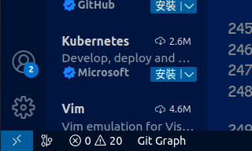
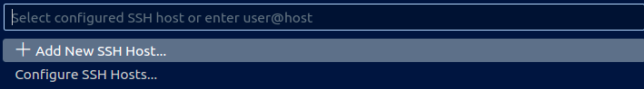
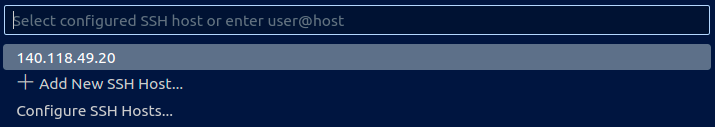
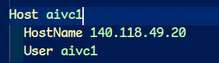

# **AIVC-Server-Booking User Manual**

## **`1. Introduction`**  

`AIVC-Server-Booking` aims to let user easily get required computing resouces such as :  

* RAM  
* GPU  
* CPU.  

Simultaneously, this system will efficiently magange server's resources between different users without conflicts.  

Our team use the package, `Docker`, as an important tool to help us distribute resources. Why we use Docker is because it has some characteristic which will be briefly introduce as following article :  

```
With Docker, you can easily package and  deploy your applicatoins. It will collect the infrastructure resouces and applications, which are needs to functions. 

Those evironmental setting are dictated by Docker file which has instructions of how to build the environment (container). You can customize it on your will. 

After running the docker file, Docker will create a corresponding container that is the environment you need to run applications. The last and important property is that Docker allows different containers operating simultaneously without affecting to other containers.
```

Because of those properties, when a user want to take advantage of server's computing capability, he no more worries about problems caused by different environments and he can focus on his project.  

Besides integrating Docker, our team try to make this system more usable so that we add additional functions to it. For example:  

1. `User can customize their required resources with CLI.`  
2. `The host maintainer can supervise the usage of server easily.`  

Now, let's start the intructions of AIVC-Server-Booking system.

---

## **`2. Before Booking......`**

Before booking AIVC server, there are somthing you should know ......

1. Ask host maintainer for a new account first. Every account has default limitation of resources. If you want more, you can go to discuss with the host maintainer.

2. You will be forbidden to access server if your used space is out of range. You must sort out your memory space before using server.

3. Every container is removed after it run out of time to release the computing resources being utilized.

4. There are three main directories in each container,  which those directories will be volumed to corresponding ones in host. Let's take a look for their purposes :  
    * `backup_dir` :  Aims to store the configs customized by the user. Next time, when you want to book server again, the booking system will build the container based on your configs, which are already backed up in `backup_dir`, to build the customization.  
    When you want to backup files or directories, you should write down you needs in `backup.yaml` and follow the form shown below :  

        ```yaml  
        # Under the Backup
        Dir: 
          - - < Backup's dir_path>    # Backup is a folder in host
            - < container's dir_path> # must be absolute path  
        
        File: 
          - - < Backup's file_path>    # Backup is a folder in host
            - < container's file_path> # must be absolute path
        ```  

        For example :

        ```yaml  
        Dir: 
        - - .default/.pyenv 
          - /root/.pyenv 
        File: 
        - - .zshrc 
          - /root/.zshrc 
        ```

    * `work_dir` :  Store user's projects and  personal dataset. Because booking system will automatically delete container with empty work_dir, you should ensure the work_dir has projects in itself to avoid your container from being removed.
    * `dataset_dir` :  It is a read-only folder and supports some common public dataset to every user such as coco dataset. If you have demands about public dataset, you can ask the host maintainer for it. The host maintainer will search it and add it into the directroy. With the management, all users can access the public dataset and no need to download again.

---

## **`3. Booking Usage`**

In this topic, I will instruct the operations of booking step by step including booking method and describe extra options.  


### `I. Auxiliary tools`  

#### **-h or --help**

Before booking, you can add `-h` option after `booking.py` command. Then you can get an introduction about system.

  ```zsh
  python3 booking.py -h
  ```

#### **-ls or --list-schedule**

With this options, CLI will output the schedule already booked.

Notice that you should ask the host maintainer for an account first then you can access this system.

### `II. Log in`

Type a command shown as following to start booking :  
*(Adding `-id or --user-id` options is necessary to log in.)*

```zsh
python3 booking.py -id <user_id>
```

Assume that you don't add any options, this system will ask you to input the password and you have two chances to input :

```bash
Password:
```

After that, describe how many resouces the container will have :

```bash
Your Maximum Capability Information: 
{ cpus:xx, memory:xx, gpus:xx }
Please enter the capability information 'cpus(float) memory(int) gpus(int)': 
```

As shown above, the first line shows the maximum limitations of CPUs, Memories and GPUs.  
The input value of all of them `cannot lower than 1`, lower number is forbidden.

After input the required computing resouces, you'll need to key in when you need this container and its end time.


The final step is to select when you want the container. There are some limits you should know :

* The input value should follow the `datetime format` or use `Time_Flags`.  
* `mm` format must be `"00"` or `"30"`.
* `Time_Flags` only can be used when the system ask you for `end time`.

```bash
Please enter the start time 'YYYY MM DD hh mm': XXXX XX XX XX
Please enter the end time 'YYYY MM DD hh mm': XXXX XX XX XX
```

Usable `Time_Flags` are shown in below form :
  | Flag | Description |
  |--|--|
  | <font color=#CE9178>now</font> | You can use the container immediately if the usage is available. |
  | <font color=#CE9178>{num}-day</font>  | The range of the <font color=#CE9178>num</font> is `1~14`, 24 hrs for a unit. |
  | <font color=#CE9178>{num}-week</font> | The range of the <font color=#CE9178>num</font> is `1~2`, 7 days for a unit. |

After system has already checked that computing resources is affordable and there isn't any problems, your booking is successfully.

### `III. Update Account Setting`

Use following command to start update config. Notice that either `-use-opt` or `--use-options` is acceptable.

```zsh
python3 booking.py -use-opt <user_id>
```

* First, The system will ask you whether you want to change forward port.  

  ```zsh
  Please enter the forward port(default: xxxxx, none by default):
  ```

  The forward port only can assign port: `10000~11000`, due to application service port. Besides, the system will automatically check whether the *forward_port* you want is duplicated. For more details, go to check [List of TCP and UDP port numbers](https://en.wikipedia.org/wiki/List_of_TCP_and_UDP_port_numbers).

* Second, you can set which docker images you want to use. The system will build the container based on your image.

  ```zsh
  Please enter the image 'repository/tag'(default: xxx, none by default): 
  ```

* Third, you can customize your extra commands which will be executed before building container. Customize it to set the environment you want.

  ```zsh
  Please enter the extra command when running the image. (default: None, none by default):
  ```

* Fourth, in this part, the system will ask you whether you want to update your password.  

  ```zsh
  Do you want to update the password?
  ```

* Final, double check your changes. Make sure you want to update the config.

  ```zsh
  The previous setting is for the once, do you want to update the default config?
  ```

---

## **`4. Extra Useful Packages Introduction`**  

After instructions, I recommend you to some packages and commands, which are useful for development.  
*( I will give you a brief introduction. If you want to realize more, you can click the name of package to browse the detail.)*

### `Environment Setting`

Every project have its own required packages. The better way to develop is to build a independent environment for each project. Every project can customize its own *Spec.* based on its requirement.  
Here are some packages which can help you manage your environment : 

### [*pipenv & pyenv*](https://medium.com/ntust-aivc/how-to-install-pyenv-pipenv-in-ubuntu-and-use-multiple-versions-of-python-and-its-suites-3514099a6e05)

With *pyenv*, you can install different versions of python in host and select the certain version which the project need. After that, use *pipenv* to create a clean virtual environment which is the developed environment. You can download the needed packages in virtual environment without messing up the host.  

### [*docker*](https://tw-yshuang.notion.site/Docker-Basic-Introduction-657f817e15a3490d83b84c8a143d6207)

*docker* can help packages up code and all its dependencies so the application runs quickly and reliably from one computing environment to another.

### `CLI Tools`

### [*git*](https://medium.com/ntust-aivc/introduction-to-git-66473777b9b3)  

*git* is a **distributed version control system**. In this system, Every coworker has a full copy of the project and project histroy. According to the project histroy, you can check who contribute the project and what kind of contribution he added so evey coworker can have an effective communication without barrier. No matter how many people you work with, *git* is a excellent tool to help you realize the whole process of project. It's worth familiarizing.

### [*htop*](https://www.ionos.com/digitalguide/server/tools/htop-the-task-manager-for-linux-mac-os-x-and-bsd/)

*htop* is a tools that can check the consumptions of computing resources such as **CPU & Memory occupancy**, **Load average**, **total number of tasks and working thread**, and **information of every process**. By means of veiwing the state of computr, you can realize which process cost large amount of resources and kill the one which have bad effects to computer. Checking computing resources help you analyze the efficacy of programs. It's worthwhile to use.

### [*tmux*](https://www.hamvocke.com/blog/a-quick-and-easy-guide-to-tmux/)

***tmux* is a terminal multiplexer.**  
It lets you switch easily between several programs in one terminal. When you detach session, the programs are still running at the background. You can re-access the old programs after retaching. Because of this property, you can run programs on background of remote service even though you have detached from that. If you want to access old programs, you can connect to the service with *ssh* and retach the programs by means of *tmux*. That is one of benefits of *tmux*.

*tmux* also can allow you to open multiple *windows* and *panes* in one terminal. Each *pane* contains its own, independtly running shell instance (bash, zsh, ...). You can operate multiple terminal commands and run applications side by side without creating multiple terminals.  

You see that tmux basically offers two major features:

1. Window management in your terminal  
2. Session management

There are some commands related to operate *tmux*. In this system, we have customized some configigurations you should know :

* `Allow using mouse` to change working place between different panes and windows.
* `Prefix hotkey has been turned into` **`Ctrl+a ( C-a )`**. 

Some of hotkeys have been changed by *tmux_config* as follow :  

|Key|Description|
|:--:|:--| 
|**`C-a`**|prefix|
|`prefix + \|` | split-window horizontally ()|
|`prefix +  -` | split-window vertically |


For reference, I list other useful hotkeys when you use *tmux* :

|Key|Description|
|:--:|:--|
|`prefix + {`  | rotate the pane clockwise|
|`prefix + }`  | rotate the pane counterclockwise|
|`prefix + c`  | create a new window |
|`prefix + n`  | switch to next window |
|`prefix + p`  | switch to previous window |
|`prefix + d`  | detach session |
|`C-d`         | kill the working pane|

Also that there are some useful commands you can use in CLI :  

```bash
# List all sessions
tmux ls                       

# Create a new session with name, <session_name>
tmux new -s <session_name>    

# Retach the session named <session_name>
tmux attach -t <session_name> 

# Kill the session with name, <session_name>
tmux kill-session -t <session_name> 

# Kill all sessions
tmux kill-session -a          

# Rename the session
tmux rename-session -t <original_session_name> <new_session_name>
```

You can go to the website to search for more tutorials of *tmux* commands.  

### `Vscode Extensions`

### [Git Graph](https://marketplace.visualstudio.com/items?itemName=mhutchie.git-graph)  

This extention give a GUI of *git*. Let you easily operate functions of *git* without commands. Especially, one of the benefits is that you can check the history of project with visualized graphic. Click the title to browse more detail.

### [Better Comments](https://marketplace.visualstudio.com/items?itemName=aaron-bond.better-comments)  

This extension supports user-friendly methods to give a comment in code file. Click the title to see a example.

### [Remote Development](https://code.visualstudio.com/docs/remote/remote-overview)

It allows you to use a **container**, **remote machine**, or the **Windows Subsystem for Linux** as a full-featured development environment. You can remotely work on the deployed operating system.  
Following pictures show the steps of using *Remote Development*.

* Click the bottom-left blue button as shown :


* Choose "Connect to Host..." to use ssh and add a new SSH HOST.



* Type the username and ip of your container. After that you have the config of container, you can access the container remotely.

If you want to change the name of container shown in the list. You can open configure and change the variable, `Host`, as follow :  


---

## `5. FAQ`

Link 到 ../docs/tips/Error  

---

# `Contributor`

## **110 Postgraduate Researcher**

* [Yu-Shun Huang](https://github.com/tw-yshuang)

## **109 Undergraduate Researcher**  

* [Tai-Cyuan Ciou](https://github.com/happy91512)
* [Yun-Ching Yeh](https://github.com/ccLLy1n)
* [Jeffrey Chen](https://github.com/Jeffrey0524)
* [Yi-Xiang Yang](https://github.com/Sean053047)


# 撰寫時備註：
yaml 不允許更改，程式是只動到CSV  
users_config.yaml : 使用者資訊，密碼、forward port、image、volume address，使用者可透過 CLI 修改 password、forward port、image、extra command
capability_config.yaml : 設備限制資訊
swap_size can't be setting. It can only be change by host.